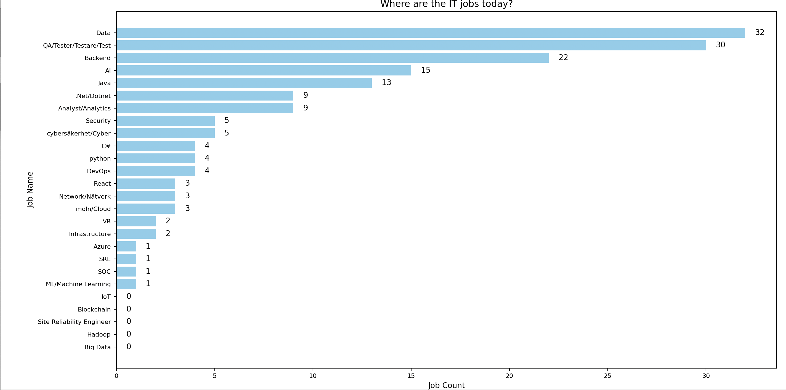

# Where Are the IT Jobs in Sweden Today?

## Background
I was laid off last year and started looking for jobs this year, but without any luck. With over 10 years of experience in mobile development and my last position at Spotify, I still haven't found anything. This has made me reflect: where are the jobs nowadays?

I understand that the market is tough due to the global recession, but seeing one tech job attracting over 100 applicants is disheartening!

I started to wonder if many of you are like me—sitting in front of your computer, sending out hundreds of applications without success. That’s when I realized I need to understand where the IT jobs are today, so I can better target my efforts.

## How Does the Script Work? 
I wrote a Python script that processes job postings from Arbetsförmedlingen Platsbanken (filteres: Stockholm and IT jobs). The search results are saved as a text file, the script searches for common IT-related keywords to identify the most frequently listed jobs.

The output from the script is visualized in the chart below:

## How to Reuse the Script
To reuse the script for your market:

1. Replace the content in the text file with job postings from your region or industry.
2. Update the search keywords in the Python script.

All the functions should work as intended after these adjustments.

## Script Limitations
Initially, I wanted to scrape the dynamic content directly from Arbetsförmedlingen Platsbanken, but the website uses JavaScript to fetch its data. Even with some twists, I could only retrieve variable names, like IDs, rather than the actual content.

If you have the time and skills to make the scraper work, that would be fantastic! For me, this is just an ad hoc experiment. I hope it can help both myself and others gain better insights into the job market.

